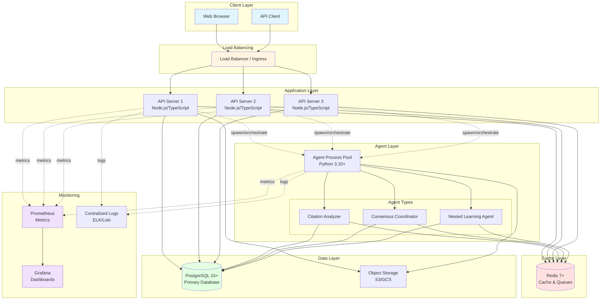
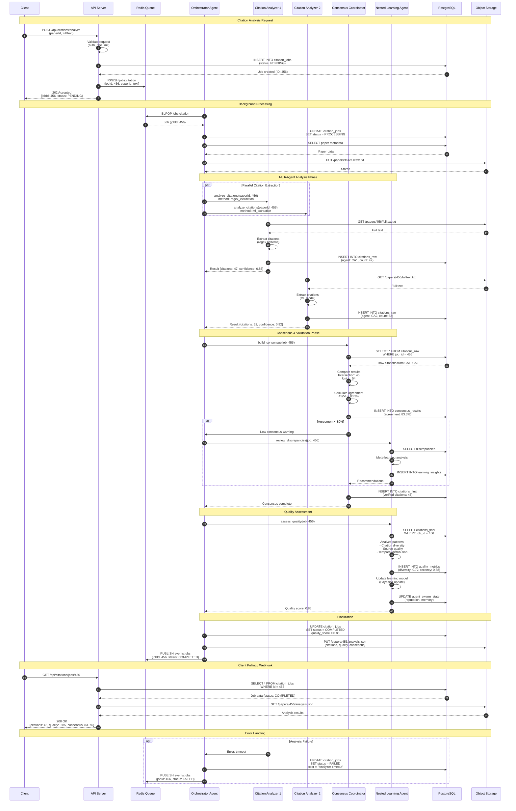
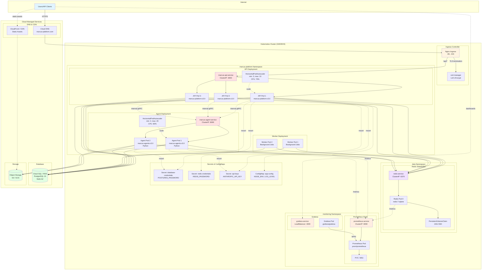
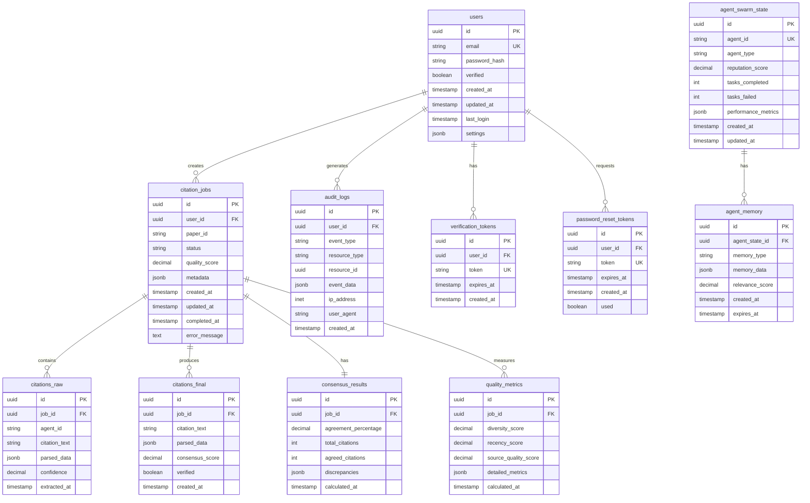

# MARCUS 3.0 Architecture Diagrams

This document provides comprehensive architecture diagrams for the MARCUS 3.0 citation integrity platform. All diagrams use Mermaid syntax for easy rendering in GitHub and documentation tools.

## Table of Contents

1. [System Architecture Overview](#system-architecture-overview)
2. [Authentication Flow](#authentication-flow)
3. [Citation Analysis Flow](#citation-analysis-flow)
4. [Agent Orchestration Data Flow](#agent-orchestration-data-flow)
5. [Kubernetes Deployment Topology](#kubernetes-deployment-topology)
6. [Database Schema](#database-schema)
7. [Metrics Pipeline](#metrics-pipeline)

---

## System Architecture Overview

High-level system architecture showing all major components and their interactions.



**Key Components:**

- **Client Layer:** Web browsers and API clients
- **Load Balancer:** Distributes traffic across API servers (Nginx, AWS ALB, GCP Load Balancer)
- **API Servers:** Node.js/TypeScript application servers (3+ replicas for HA)
- **Agent Pool:** Python-based citation analysis agents (spawned on-demand)
- **Cache Layer:** Redis for session storage, rate limiting, job queues
- **Data Layer:** PostgreSQL for persistent storage, S3/GCS for artifacts
- **Monitoring:** Prometheus metrics, Grafana dashboards, centralized logging

---

## Authentication Flow

Detailed sequence diagram showing user authentication with JWT tokens and session management.

```mermaid
sequenceDiagram
    autonumber
    participant Client
    participant LB as Load Balancer
    participant API as API Server
    participant Redis
    participant DB as PostgreSQL
    participant Email as Email Service

    Note over Client,Email: User Registration Flow

    Client->>LB: POST /api/auth/register
    LB->>API: Forward request
    API->>API: Validate input<br/>(email, password strength)
    API->>DB: Check if user exists
    DB-->>API: User not found
    API->>API: Hash password (bcrypt, cost=12)
    API->>DB: INSERT INTO users
    DB-->>API: User created (ID: 123)
    API->>API: Generate verification token
    API->>DB: INSERT INTO verification_tokens
    API->>Email: Send verification email
    Email-->>Client: Verification email sent
    API-->>Client: 201 Created {userId, message}

    Note over Client,Email: Email Verification Flow

    Client->>LB: GET /api/auth/verify/:token
    LB->>API: Forward request
    API->>DB: SELECT * FROM verification_tokens<br/>WHERE token = :token
    DB-->>API: Token found, user_id: 123
    API->>DB: UPDATE users SET verified = true
    API->>DB: DELETE FROM verification_tokens
    API-->>Client: 200 OK {verified: true}

    Note over Client,Email: Login Flow

    Client->>LB: POST /api/auth/login<br/>{email, password}
    LB->>API: Forward request
    API->>DB: SELECT * FROM users WHERE email = :email
    DB-->>API: User found (id: 123, password_hash)
    API->>API: Compare password<br/>(bcrypt.compare)

    alt Password invalid
        API-->>Client: 401 Unauthorized
    end

    API->>API: Check if verified

    alt Not verified
        API-->>Client: 403 Forbidden<br/>(verify email first)
    end

    API->>Redis: Increment login_attempts:<br/>user:123
    Redis-->>API: Attempts: 1

    API->>API: Generate JWT tokens<br/>(access + refresh)
    API->>Redis: SET session:uuid<br/>{userId, refreshToken}<br/>EX 604800
    API->>DB: UPDATE users SET last_login = NOW()
    API->>DB: INSERT INTO audit_log<br/>(LOGIN_SUCCESS)
    API-->>Client: 200 OK<br/>{accessToken, refreshToken}

    Note over Client,Email: Authenticated Request Flow

    Client->>LB: GET /api/citations<br/>Authorization: Bearer {accessToken}
    LB->>API: Forward request
    API->>API: Verify JWT signature

    alt Token expired or invalid
        API-->>Client: 401 Unauthorized
    end

    API->>API: Extract userId from token
    API->>Redis: GET session:uuid
    Redis-->>API: Session found
    API->>DB: SELECT protected resource
    DB-->>API: Resource data
    API-->>Client: 200 OK {data}

    Note over Client,Email: Token Refresh Flow

    Client->>LB: POST /api/auth/refresh<br/>{refreshToken}
    LB->>API: Forward request
    API->>Redis: GET session:uuid
    Redis-->>API: Session found {userId: 123}
    API->>API: Verify refresh token
    API->>API: Generate new access token
    API-->>Client: 200 OK {accessToken}

    Note over Client,Email: Logout Flow

    Client->>LB: POST /api/auth/logout<br/>{refreshToken}
    LB->>API: Forward request
    API->>Redis: DEL session:uuid
    API->>DB: INSERT INTO audit_log<br/>(LOGOUT)
    API-->>Client: 200 OK

    Note over Client,Email: Password Reset Flow

    Client->>LB: POST /api/auth/forgot-password<br/>{email}
    LB->>API: Forward request
    API->>DB: SELECT * FROM users WHERE email = :email
    DB-->>API: User found (id: 123)
    API->>API: Generate reset token<br/>(crypto.randomBytes)
    API->>DB: INSERT INTO password_reset_tokens<br/>(user_id, token, expires_at)
    API->>Email: Send reset email<br/>(link with token)
    Email-->>Client: Reset email sent
    API-->>Client: 200 OK

    Client->>LB: POST /api/auth/reset-password<br/>{token, newPassword}
    LB->>API: Forward request
    API->>DB: SELECT * FROM password_reset_tokens<br/>WHERE token = :token
    DB-->>API: Token valid, user_id: 123
    API->>API: Check expiration<br/>(expires_at > NOW())
    API->>API: Hash new password
    API->>DB: UPDATE users SET password_hash
    API->>DB: DELETE FROM password_reset_tokens
    API->>Redis: DEL all sessions for user:123
    API->>DB: INSERT INTO audit_log<br/>(PASSWORD_RESET)
    API-->>Client: 200 OK
```



**Security Features:**

- **Password Hashing:** bcrypt with cost factor 12
- **JWT Tokens:** Access token (15 min expiry) + Refresh token (7 days)
- **Session Management:** Redis-backed sessions with automatic expiration
- **Rate Limiting:** Login attempt tracking per user
- **Audit Logging:** All authentication events logged to PostgreSQL
- **Email Verification:** Required before account activation
- **Password Reset:** Time-limited tokens with single-use enforcement

---

## Citation Analysis Flow

Sequence diagram showing the complete citation analysis workflow with multi-agent coordination.



**Analysis Pipeline Features:**

- **Multi-Agent Extraction:** Parallel citation extraction using different methods (regex, ML)
- **Consensus Building:** Cross-validation between agents, agreement threshold enforcement
- **Nested Learning:** Meta-learning agent analyzes discrepancies and updates models
- **Quality Metrics:** Citation diversity, source quality, temporal distribution analysis
- **Fault Tolerance:** Timeout handling, retry logic, error state persistence
- **Result Storage:** S3 for large analysis artifacts, PostgreSQL for metadata
- **Real-time Updates:** Redis pub/sub for job status notifications

---

## Agent Orchestration Data Flow

Data flow diagram showing how agents communicate and coordinate through Redis and PostgreSQL.

```mermaid
graph TB
    subgraph "API Layer"
        API[API Server<br/>TypeScript]
    end

    subgraph "Message Queue"
        RedisQueue[(Redis Queues)]
        JobQueue[jobs:citation]
        EventBus[events:jobs]
        AgentQueue[agents:tasks]
    end

    subgraph "Agent Orchestrator"
        Orchestrator[Orchestrator Service<br/>Python]
    end

    subgraph "Agent Pool"
        CA1[Citation Analyzer 1]
        CA2[Citation Analyzer 2]
        CC[Consensus Coordinator]
        NL[Nested Learning]
    end

    subgraph "State Management"
        AgentState[(PostgreSQL<br/>agent_swarm_state)]
        JobState[(PostgreSQL<br/>citation_jobs)]
        ResultCache[(Redis<br/>Cached Results)]
    end

    subgraph "Storage"
        S3[(Object Storage<br/>S3/GCS)]
    end

    %% Job submission flow
    API -->|1. RPUSH job| JobQueue
    API -->|2. INSERT job record| JobState

    %% Orchestrator picks up job
    Orchestrator -->|3. BLPOP| JobQueue
    Orchestrator -->|4. UPDATE status| JobState
    Orchestrator -->|5. Read metadata| JobState

    %% Orchestrator spawns agents
    Orchestrator -->|6. RPUSH tasks| AgentQueue
    Orchestrator -->|7. UPDATE state| AgentState

    %% Agents process tasks
    AgentQueue -->|8. BLPOP| CA1
    AgentQueue -->|8. BLPOP| CA2

    CA1 -->|9. Read state| AgentState
    CA2 -->|9. Read state| AgentState

    CA1 -->|10. GET artifact| S3
    CA2 -->|10. GET artifact| S3

    CA1 -->|11. Process citations| CA1
    CA2 -->|11. Process citations| CA2

    CA1 -->|12. PUT results| S3
    CA2 -->|12. PUT results| S3

    CA1 -->|13. INSERT raw results| JobState
    CA2 -->|13. INSERT raw results| JobState

    CA1 -->|14. RPUSH complete| AgentQueue
    CA2 -->|14. RPUSH complete| AgentQueue

    %% Consensus phase
    Orchestrator -->|15. Trigger consensus| CC
    CC -->|16. SELECT raw results| JobState
    CC -->|17. Calculate agreement| CC
    CC -->|18. INSERT consensus| JobState
    CC -->|19. PUBLISH event| EventBus

    %% Learning phase
    Orchestrator -->|20. Trigger learning| NL
    NL -->|21. SELECT final results| JobState
    NL -->|22. Analyze patterns| NL
    NL -->|23. UPDATE state<br/>(reputation, memory)| AgentState
    NL -->|24. INSERT metrics| JobState

    %% Finalization
    Orchestrator -->|25. UPDATE status<br/>COMPLETED| JobState
    Orchestrator -->|26. SET cache| ResultCache
    Orchestrator -->|27. PUBLISH done| EventBus

    %% API retrieves results
    API -->|28. GET from cache| ResultCache
    ResultCache -.->|cache miss| API
    API -->|29. SELECT results| JobState
    API -->|30. GET analysis| S3

    style API fill:#e1f5ff
    style Orchestrator fill:#fff4e1
    style CA1 fill:#ffe1e1
    style CA2 fill:#ffe1e1
    style CC fill:#ffe1e1
    style NL fill:#ffe1e1
    style AgentState fill:#e1ffe1
    style JobState fill:#e1ffe1
    style ResultCache fill:#f0e1ff
```

**Data Flow Patterns:**

1. **Job Submission:** API → Redis Queue → PostgreSQL (job record)
2. **Orchestration:** Orchestrator polls queue → spawns agents → tracks state
3. **Parallel Processing:** Multiple agents work simultaneously on tasks
4. **State Synchronization:** All agents read/write to shared PostgreSQL state
5. **Result Aggregation:** Consensus coordinator merges agent outputs
6. **Learning Loop:** Nested learning agent updates models based on results
7. **Caching:** Redis caches frequently accessed results
8. **Event Notifications:** Pub/sub for real-time status updates

---

## Kubernetes Deployment Topology

Detailed Kubernetes cluster architecture with all services, pods, and networking.



**Kubernetes Resources:**

**Namespaces:**
- `marcus-platform` - Application workloads
- `data` - Redis StatefulSet
- `monitoring` - Prometheus, Grafana
- `ingress-nginx` - Ingress controller

**Deployments:**
- `marcus-api` - 3 replicas (HPA: 3-10)
- `marcus-agents` - 2 replicas (HPA: 2-20)
- `marcus-workers` - 2 replicas (background jobs)

**StatefulSets:**
- `redis` - 1 replica with persistent storage (10Gi SSD)

**Services:**
- `marcus-api-service` - ClusterIP (internal)
- `marcus-agent-service` - ClusterIP (internal)
- `redis-service` - ClusterIP (internal)
- `grafana-service` - LoadBalancer (external)

**Ingress:**
- TLS termination with cert-manager
- Routes `/api/*` to API service
- Automatic HTTPS redirection

**Autoscaling:**
- API HPA: 3-10 pods (70% CPU target)
- Agent HPA: 2-20 pods (80% CPU target)
- Cluster Autoscaler for node scaling

---

## Database Schema

Entity-relationship diagram showing core database tables and relationships.



**Key Tables:**

- **users:** User accounts with authentication credentials
- **citation_jobs:** Citation analysis job tracking
- **citations_raw:** Raw citation extraction results from individual agents
- **citations_final:** Consensus-validated final citations
- **consensus_results:** Agreement metrics between agents
- **quality_metrics:** Citation quality assessment scores
- **agent_swarm_state:** Agent reputation and performance tracking
- **agent_memory:** Agent learning and context storage
- **audit_logs:** Security and compliance event logging
- **verification_tokens:** Email verification tokens
- **password_reset_tokens:** Password reset flow tokens

**Indexes:**
- All foreign keys indexed
- `users.email` unique index
- `citation_jobs.status` index (for job polling)
- `audit_logs.created_at` index (for log queries)
- `agent_swarm_state.agent_id` unique index
- Composite index on `(user_id, created_at)` for user history queries

---

## Metrics Pipeline

Data flow showing how metrics are collected, aggregated, and visualized.

```mermaid
graph LR
    subgraph "Application Layer"
        API[API Server<br/>prom-client]
        Agent[Agent Process<br/>prometheus-python]
        Worker[Worker Process<br/>prom-client]
    end

    subgraph "Metrics Collection"
        API -->|HTTP /metrics| Metrics_API[API Metrics<br/>• Request count<br/>• Response time<br/>• Error rate]
        Agent -->|HTTP /metrics| Metrics_Agent[Agent Metrics<br/>• Tasks processed<br/>• Accuracy<br/>• Processing time]
        Worker -->|HTTP /metrics| Metrics_Worker[Worker Metrics<br/>• Jobs completed<br/>• Queue depth<br/>• Failure rate]
    end

    subgraph "Infrastructure Metrics"
        K8s[Kubernetes<br/>kube-state-metrics] -->|cluster state| Metrics_K8s[K8s Metrics<br/>• Pod status<br/>• Resource usage<br/>• Node health]
        DB[(PostgreSQL<br/>postgres_exporter)] -->|DB stats| Metrics_DB[DB Metrics<br/>• Connections<br/>• Query time<br/>• Lock waits]
        Redis_Metrics[(Redis<br/>redis_exporter)] -->|Redis stats| Metrics_Redis[Redis Metrics<br/>• Memory usage<br/>• Hit rate<br/>• Evictions]
    end

    subgraph "Prometheus"
        Prometheus[Prometheus Server<br/>Scrape interval: 15s]
        Prometheus -->|scrape| Metrics_API
        Prometheus -->|scrape| Metrics_Agent
        Prometheus -->|scrape| Metrics_Worker
        Prometheus -->|scrape| Metrics_K8s
        Prometheus -->|scrape| Metrics_DB
        Prometheus -->|scrape| Metrics_Redis

        Prometheus -->|store| TSDB[(Time Series DB<br/>Retention: 30d)]
    end

    subgraph "Alerting"
        Prometheus -->|evaluate| AlertRules[Alert Rules<br/>• High error rate<br/>• Low consensus<br/>• Resource exhaustion]
        AlertRules -->|trigger| AlertManager[Alertmanager<br/>Deduplication<br/>Routing<br/>Silencing]
        AlertManager -->|notify| PagerDuty[PagerDuty<br/>Critical alerts]
        AlertManager -->|notify| Slack[Slack<br/>Warning alerts]
        AlertManager -->|notify| Email[Email<br/>Info alerts]
    end

    subgraph "Visualization"
        TSDB -->|PromQL queries| Grafana[Grafana Dashboards]
        Grafana -->|display| Dashboard_Ops[Operations Dashboard<br/>• System health<br/>• Resource usage<br/>• Error rates]
        Grafana -->|display| Dashboard_Business[Business Dashboard<br/>• Jobs processed<br/>• Quality scores<br/>• User activity]
        Grafana -->|display| Dashboard_Agents[Agent Performance<br/>• Accuracy trends<br/>• Consensus rates<br/>• Learning progress]
    end

    style API fill:#e1f5ff
    style Agent fill:#e1f5ff
    style Worker fill:#e1f5ff
    style Prometheus fill:#ffe1e1
    style TSDB fill:#f0e1ff
    style Grafana fill:#e1ffe1
    style AlertManager fill:#fff4e1
```

**Metrics Categories:**

**Application Metrics:**
- Request rate, latency, error rate (RED method)
- Citation job throughput and quality scores
- Agent consensus agreement percentages
- User authentication success/failure rates

**Infrastructure Metrics:**
- CPU, memory, disk, network usage
- Kubernetes pod/node health
- Database connection pool usage
- Redis cache hit/miss rates

**Business Metrics:**
- Daily active users
- Citations analyzed per hour
- Average quality score
- Cost per citation (cloud spend)

**Alert Rules:**
```yaml
# High error rate
- alert: HighErrorRate
  expr: rate(http_requests_total{status=~"5.."}[5m]) > 0.05
  for: 5m
  severity: critical

# Low consensus
- alert: LowConsensusRate
  expr: avg_over_time(citation_consensus_agreement[1h]) < 0.7
  for: 15m
  severity: warning

# Database connection exhaustion
- alert: DatabaseConnectionsHigh
  expr: pg_stat_database_numbackends / pg_settings_max_connections > 0.8
  for: 5m
  severity: critical
```

---

## Summary

This document provides comprehensive architecture diagrams for the MARCUS 3.0 platform, covering:

1. **System Architecture:** High-level component overview and interactions
2. **Authentication Flow:** Detailed JWT-based authentication with security measures
3. **Citation Analysis:** Multi-agent citation extraction and consensus workflow
4. **Agent Orchestration:** Data flow between agents, queues, and storage
5. **Kubernetes Topology:** Complete cluster architecture with autoscaling
6. **Database Schema:** Entity relationships and data model
7. **Metrics Pipeline:** Observability infrastructure for monitoring and alerting

All diagrams use Mermaid syntax and can be rendered in GitHub, GitLab, VS Code, and most documentation tools.

For implementation details, refer to:
- **Deployment Guide:** `docs/MARCUS_DEPLOYMENT_GUIDE.md`
- **API Documentation:** `docs/MARCUS_API_REFERENCE.md`
- **Task Checklist:** `docs/MARCUS_CONSOLIDATED_TASK_CHECKLIST.md`
