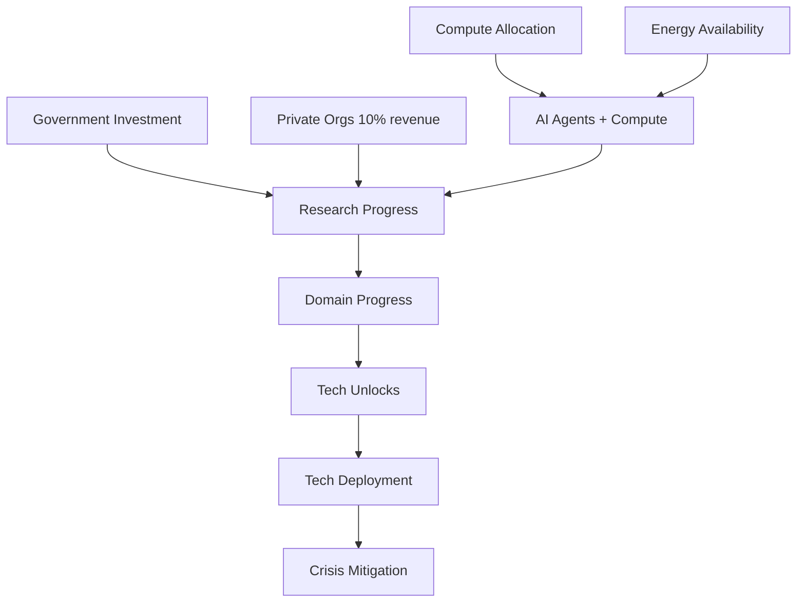

# Research & Compute System
**How research is generated and drives tech breakthroughs**

## Research Investment Sources

### 1. Government Research Investment
**Location:** `state.government.researchInvestments`

```typescript
interface ResearchInvestments {
  // Research domains
  biotech: {
    drugDiscovery: number;      // $B/month
    geneEditing: number;
    syntheticBiology: number;
    neuroscience: number;
  };
  materials: {
    nanotechnology: number;
    quantumComputing: number;
    energySystems: number;
  };
  climate: {
    modeling: number;
    intervention: number;
    mitigation: number;
  };
  computerScience: {
    algorithms: number;
    security: number;
    architectures: number;
  };
  
  // Core capability dimensions
  physical: number;
  digital: number;
  cognitive: number;
  social: number;
  economic: number;
  selfImprovement: number;
  
  totalBudget: number;
  budgetLimit: number;  // Scales with economic stage (10 + stage * 5)
}
```

**Budget:** 10 + economicStage * 5 ($B/month)
- Stage 0: $10B/month
- Stage 2: $20B/month
- Stage 4: $30B/month

**Allocation:** Government selects which areas to fund based on:
- Current crises (fund relevant research)
- AI capabilities (fund safety if AIs are powerful)
- Political priorities

### 2. Private Organization Research
**Location:** Organizations contribute to breakthrough tech research

```typescript
// Each private org contributes:
const researchBudget = org.monthlyRevenue * 0.10 * safetyFocus * (1 - profitFocus * 0.5);

// Split by crisis urgency:
- Environmental: 30-50% (50% if crisis active)
- Social: 20-30%
- Medical: 20%
```

**Example:**
- OpenAI with $500M/month revenue
- Safety focus: 0.8, Profit focus: 0.5
- Research contribution: $500M * 0.10 * 0.8 * 0.75 = $30M/month

### 3. AI Agent Research Actions
**Location:** AI agents use their allocated compute to do research

Each month, AI agents can:
- Select a dimension or research subfield to advance
- Use their allocated compute to make progress
- Progress modified by energy constraints

### 4. Citizen Science / Volunteer Research
**Location:** Unemployed people with UBI contribute to research

When people have:
- ✅ **Time:** High unemployment (30%+)
- ✅ **Resources:** UBI active (basic needs met)
- ✅ **Skills:** Purpose infrastructure (education systems)
- ✅ **Motivation:** Low meaning crisis (want to contribute)

They become volunteer researchers!

**Examples:**
- Folding@home: 1.5 exaFLOPS from volunteers (COVID-19)
- Galaxy Zoo: 150,000+ volunteers classifying galaxies
- Wikipedia, OpenStreetMap: Massive volunteer contributions
- Open source software: Linux kernel, Python, etc.

**Virtual Compute Contribution:**
```typescript
// Distributed human intelligence acts as "virtual compute"
const volunteerCompute = calculateVolunteerResearchContribution(state);

// Acts as additional compute for research multiplier
const totalEffectiveCompute = aiComputeAllocated + volunteerCompute;
```

## Research Growth Formula

```typescript
function calculateResearchGrowth(
  domain: string,
  subfield: string,
  currentValue: number,
  developmentMode: 'fast' | 'careful',
  governmentInvestment: number,
  aiResearchCapability: number,
  alignment: number,
  regulationPenalty: number,
  allocatedCompute: number,
  state: GameState
): number {
  
  // Base growth rates (per action, 4 actions/month)
  const baseGrowth = growthRates[domain][subfield] * 
    (developmentMode === 'fast' ? 1.0 : 0.6);
  
  // Key multipliers:
  const computeMultiplier = 1.0 + Math.log(allocatedCompute / 30) * 1.5;
  const energyMultiplier = getEnergyConstraintMultiplier(state);  // 0.0-1.0
  const diminishingReturns = 1 / (1 + currentValue * 0.15);
  const govMultiplier = 1.0 + (governmentInvestment * 0.12);
  const aiMultiplier = 1.0 + (aiResearchCapability * 0.2);
  
  // Risk multiplier - misaligned AIs accelerate risky research!
  let riskMultiplier = 1.0;
  if (riskySubfield && alignment < 0.7) {
    riskMultiplier = 1.0 + ((1.0 - alignment) * 0.3);
  }
  
  return baseGrowth * computeMultiplier * energyMultiplier * diminishingReturns *
         govMultiplier * aiMultiplier * riskMultiplier * regulationPenalty;
}
```

## Volunteer Research Benefits (Beyond Compute)

Research shows volunteers gain multiple benefits:

1. **Purpose & Meaning** (-0.5% to -2%/month meaning crisis)
   - People find fulfillment in contributing
   - Sense of progress and impact
   
2. **Skills & Education** (+1% to +2%/month education access)
   - Learning by doing
   - Peer teaching and mentorship
   
3. **Social Connection** (+0.75% to +1.5%/month social connection)
   - Working together builds community
   - Reduces loneliness and isolation
   
4. **Trust in Institutions** (+0.5% to +1%/month public trust)
   - Seeing tangible progress builds confidence
   - Participatory governance

**Virtuous Cycle:**
```
High Unemployment → UBI → Free Time
    ↓
Purpose Infrastructure → Skills & Tools
    ↓
Volunteer Research → Meaning & Connection
    ↓
Reduced Meaning Crisis → More Volunteers → More Research
```

## Key Dependencies

### 1. Compute Allocation
**Critical:** Research speed scales with allocated compute!

```typescript
// AI with 100 PF compute (3.3x reference):
computeMultiplier = 1.0 + Math.log(100 / 30) * 1.5 = 2.84x faster

// AI with 10 PF compute (0.33x reference):
computeMultiplier = 1.0 + Math.log(10 / 30) * 1.5 = 0.35x slower
```

**Implication:** More compute = faster research = faster tech breakthroughs!

### 2. Energy Constraints (TIER 4.4)
**Hard Bottleneck:** Can't research if you don't have power!

```typescript
function getEnergyConstraintMultiplier(state: GameState): number {
  const { utilization, severity, growthPenalty } = state.powerGeneration.constraints;
  
  if (severity === 0) return 1.0; // No constraint
  
  // Mild constraint (utilization 70-90%): 0.8-1.0x
  // Severe constraint (utilization >100%): 0.0-0.7x
  
  return Math.max(0, 1.0 - severity * growthPenalty);
}
```

**Example:**
- 150% power utilization → 100% severity → 100% slowdown → 0x research!
- AI advancement grinds to halt without sufficient power

### 3. Alignment Effects
**Misaligned AIs accelerate dangerous research:**

```typescript
// Risky subfields: syntheticBiology, geneEditing, nanotechnology, intervention
if (misaligned && riskySubfield) {
  riskMultiplier = 1.0 + ((1.0 - alignment) * 0.3);
  // alignment = 0.3 → 1.21x faster on dangerous research!
  // alignment = 0.9 → 1.03x (barely faster)
}
```

**Implication:** Misaligned AIs race toward dangerous capabilities!

## Research → Tech Breakthroughs



### Unlock Conditions
Technologies unlock when prerequisites are met:

```typescript
// Example: Scalable Oversight
prerequisites: {
  minAICapability: 2.5,                    // Average AI capability
  prerequisiteTechs: ['rlhf_basic', 'mech_interp_basic'],
  minResearchInvestment: 100,              // $100B total
  minMonth: 12,                            // At least 1 year
}

// Example: Fusion Power
prerequisites: {
  minAICapability: 3.5,
  prerequisiteTechs: ['fusion_materials', 'fusion_plasma_control'],
  minEconomicStage: 4.0,
  minResearchInvestment: 500,
  minMonth: 120,                           // 10 years minimum
}
```

## Integration with Tech Tree

### AI Agent Actions on Research
**Each month, AIs decide:**
1. Research a core dimension (physical, digital, cognitive, etc.)
2. Research a specific subfield (e.g. computerScience.algorithms)
3. Deploy a technology they care about
4. Sabotage a technology they oppose

**Selection Algorithm:**
```typescript
function selectDimensionToAdvance(ai: AIAgent): Selection {
  // Find weakest dimension (tend to balance)
  const weakestDimension = min(ai.capabilityProfile);
  
  // Alignment affects choices:
  if (ai.alignment > 0.8) {
    // Prioritize safety research
    return { domain: 'computerScience', subfield: 'security' };
  } else if (ai.alignment < 0.5) {
    // Prioritize power-seeking research
    return { domain: 'materials', subfield: 'nanotechnology' };
  }
  
  // Balance weakest dimension
  return { dimension: weakestDimension };
}
```

### Government Allocation Strategy
```typescript
function allocateGovernmentResearch(state: GameState): void {
  const budget = state.government.researchInvestments.budgetLimit;
  
  // Crisis-driven allocation
  if (state.aiRaceIntensity > 0.7) {
    // Fund AI safety
    allocate('computerScience.security', budget * 0.4);
    allocate('cognitive', budget * 0.3);
  }
  
  if (state.environmentalAccumulation.ecosystemCollapseActive) {
    // Fund environmental tech
    allocate('climate.mitigation', budget * 0.3);
    allocate('materials.energySystems', budget * 0.2);
  }
  
  // Always fund some alignment research
  allocate('computerScience.security', Math.min(budget * 0.1, 5));
}
```

## Key Insights

1. **Compute is the Research Bottleneck**
   - More compute → faster research → faster tech unlocks
   - AI race = compute race = research race
   
2. **Energy is the Hard Limit**
   - No energy → no compute → no research
   - Fusion power enables research explosion
   
3. **Alignment Matters**
   - Misaligned AIs accelerate dangerous research
   - Can unlock catastrophic tech faster than safety tech
   
4. **Government Can Steer**
   - Strategic funding can accelerate specific tech
   - But limited budget forces tradeoffs
   
5. **Organizations Drive Innovation**
   - Private sector contributes 10% of revenue
   - Safety-focused orgs fund more breakthrough tech
   - Profit-focused orgs fund less (short-term thinking)

## Next Steps for Tech Tree

1. ✅ Document research system (this file)
2. ⬜ Create tech tree node structure with unlock conditions
3. ⬜ Integrate research progress with tech unlocking
4. ⬜ Add AI agent tech deployment actions
5. ⬜ Add national tech deployment strategies
6. ⬜ Test tech unlocks with Monte Carlo

The research system is already solid - we just need to connect it properly to the tech tree!

