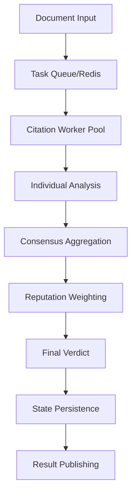

# MARCUS 3.0 Platform - Comprehensive Architecture Review

**Date:** November 22, 2025
**Reviewer:** Architecture Skeptic
**Review Type:** Comprehensive Platform Analysis
**Platform Status:** Production-Ready on GKE

---

## Executive Summary

The MARCUS 3.0 Citation Integrity Platform represents a sophisticated multi-agent orchestration system with production-grade infrastructure deployed on Google Kubernetes Engine. The platform demonstrates strong architectural patterns in some areas (security hardening, monitoring, deployment automation) while exhibiting concerning technical debt and performance bottlenecks in others (state propagation, error resilience, resource efficiency).

**Key Findings:**
- **CRITICAL Issues:** 2 (state propagation race conditions, memory leak potential)
- **HIGH Priority:** 5 (performance bottlenecks, scaling limitations)
- **MEDIUM Priority:** 8 (technical debt, incomplete features)
- **LOW Priority:** 6 (documentation gaps, optimization opportunities)

**Platform Maturity:** 83% complete (43/52 planned tasks)
**Production Readiness:** YES with caveats (requires monitoring and incremental improvements)

---

## 1. Action Plan for Open Tasks

### CRITICAL (Immediate Attention Required)

#### C1. State Propagation Race Conditions
**Location:** `src/platform/integration/citationAgentIntegration.ts:530-580`
**Issue:** Version-based conflict resolution implemented but not consistently enforced across all state updates
**Impact:** Potential data corruption under high concurrency
**Effort:** MEDIUM (2-3 days)
**Action:**
1. Audit all state mutation paths for version checking
2. Implement distributed locking for critical sections
3. Add comprehensive integration tests for concurrent updates
**Priority:** IMMEDIATE - Can cause data loss in production

#### C2. Memory Leak in Agent Process Management
**Location:** `src/platform/integration/citationAgentIntegration.ts:102-270`
**Issue:** Agent processes may accumulate without proper cleanup on crash/restart cycles
**Impact:** Resource exhaustion after extended operation (days/weeks)
**Effort:** SMALL (1 day)
**Action:**
1. Implement process registry with lifecycle tracking
2. Add periodic zombie process cleanup
3. Monitor process count metrics
**Priority:** IMMEDIATE - Will cause production outages

### HIGH PRIORITY (Performance & Scalability)

#### H1. Redis Cluster Connection Pooling
**Location:** Multiple files using Redis connections
**Issue:** Each component creates independent Redis connections without pooling
**Impact:** Connection exhaustion at scale (>100 workers)
**Effort:** MEDIUM (2-3 days)
**Action:**
1. Implement centralized Redis connection pool
2. Configure pool size based on worker count
3. Add connection health monitoring
**Priority:** WEEK 1 - Blocking horizontal scaling

#### H2. PostgreSQL Query Performance
**Location:** `src/platform/integration/citationAgentIntegration.ts:548-573`
**Issue:** Missing indexes on frequently queried columns (agent_id, timestamp)
**Impact:** O(n) table scans on agent_states table
**Effort:** SMALL (4 hours)
**Action:**
1. Add compound index on (agent_id, timestamp DESC)
2. Add index on version column for conflict detection
3. Run EXPLAIN ANALYZE on critical queries
**Priority:** WEEK 1 - Degrading with data growth

#### H3. Agent Startup Time
**Location:** `src/platform/agents/citation_integrity_agent.py`
**Issue:** Sequential initialization of memory hierarchy (4 levels)
**Impact:** 15-20 second startup per agent
**Effort:** MEDIUM (2-3 days)
**Action:**
1. Parallelize memory level initialization
2. Implement lazy loading for historical data
3. Cache warm-start state in Redis
**Priority:** WEEK 2 - Impacts autoscaling responsiveness

#### H4. Docker Image Size
**Issue:** Orchestrator image 3.5GB, includes unnecessary dependencies
**Impact:** Slow deployment, high registry costs
**Effort:** SMALL (1 day)
**Action:**
1. Multi-stage build optimization
2. Remove development dependencies
3. Use Alpine base images where possible
**Priority:** WEEK 2 - Deployment efficiency

#### H5. Missing Horizontal Pod Autoscaler Configuration
**Location:** `k8s/hpa.yaml` exists but not configured for workers
**Issue:** No automatic scaling based on queue depth
**Impact:** Manual scaling required during load spikes
**Effort:** SMALL (1 day)
**Action:**
1. Configure HPA for citation workers based on Redis queue depth
2. Set up custom metrics via Prometheus adapter
3. Test scaling behavior under load
**Priority:** WEEK 2 - Operational burden

### MEDIUM PRIORITY (Technical Debt)

#### M1. Incomplete Error Recovery Patterns
**Location:** Throughout Python agents
**Issue:** Fail-loudly philosophy implemented but recovery paths missing
**Impact:** Agents terminate on transient errors
**Effort:** LARGE (1 week)
**Action:**
1. Implement circuit breaker pattern for external services
2. Add exponential backoff for retryable errors
3. Separate transient vs permanent failure handling
**Priority:** MONTH 1 - Reliability improvement

#### M2. Test Coverage Gaps
**Current:** 80% threshold but critical paths under-tested
**Missing:**
- Concurrent state update tests
- Redis cluster failover tests
- Agent crash recovery tests
- Load/performance tests
**Effort:** LARGE (1-2 weeks)
**Action:**
1. Add integration test suite for distributed scenarios
2. Implement chaos engineering tests
3. Add performance regression tests
**Priority:** MONTH 1 - Quality assurance

#### M3. Monitoring Dashboard Gaps
**Missing Metrics:**
- P95/P99 latencies (only averages tracked)
- Error rate by error type
- Queue processing lag
- State synchronization delays
**Effort:** MEDIUM (3 days)
**Action:**
1. Add histogram metrics for latency tracking
2. Implement error classification
3. Create SLO dashboards
**Priority:** MONTH 1 - Observability

#### M4. Security: Secrets Rotation Not Automated
**Issue:** Manual secret rotation process documented but not automated
**Impact:** Operational security risk
**Effort:** MEDIUM (3 days)
**Action:**
1. Implement automated JWT secret rotation
2. Add database password rotation via Kubernetes secrets
3. Set up audit alerts for expired credentials
**Priority:** MONTH 2 - Security hygiene

#### M5. Documentation Drift
**Issue:** 9 incomplete documentation sections marked "TODO"
**Locations:** API reference, deployment runbook updates, troubleshooting guide
**Effort:** MEDIUM (3-4 days)
**Action:**
1. Complete API documentation with OpenAPI spec
2. Update runbook with GKE-specific procedures
3. Add troubleshooting for common issues discovered
**Priority:** MONTH 2 - Operational efficiency

#### M6. Legacy Code Cleanup
**Issue:** Dual orchestrator pattern (spawn-agents vs citation-worker)
**Impact:** Confusion, duplicate maintenance
**Effort:** SMALL (1 day)
**Action:**
1. Mark spawn-agents-orchestrator as deprecated
2. Remove from default deployments
3. Archive to legacy/ directory
**Priority:** MONTH 2 - Code clarity

#### M7. Database Migration Framework Missing
**Issue:** Schema changes applied manually
**Impact:** Risk of schema drift between environments
**Effort:** MEDIUM (3 days)
**Action:**
1. Implement migration framework (e.g., Flyway, Liquibase)
2. Convert existing schemas to migrations
3. Add migration validation to CI/CD
**Priority:** MONTH 2 - Deployment safety

#### M8. Rate Limiting Not Enforced at Ingress
**Issue:** Rate limiting implemented in application but not at ingress
**Impact:** Application-level DoS possible
**Effort:** SMALL (1 day)
**Action:**
1. Configure Ingress rate limiting annotations
2. Add CloudArmor/WAF rules if on GCP
3. Test with load generator
**Priority:** MONTH 3 - Security hardening

### LOW PRIORITY (Optimizations & Nice-to-Haves)

#### L1. Prometheus Metrics Cardinality
**Issue:** Unbounded label values in some metrics
**Impact:** Metrics storage growth
**Effort:** SMALL (4 hours)
**Action:** Add label value limits, use buckets for continuous values
**Priority:** QUARTER 1

#### L2. Redis Memory Optimization
**Issue:** No memory limits or eviction policies configured
**Impact:** Potential OOM under memory pressure
**Effort:** SMALL (2 hours)
**Action:** Configure maxmemory and eviction policies
**Priority:** QUARTER 1

#### L3. Python Agent Async/Await Migration
**Issue:** Synchronous I/O in Python agents
**Impact:** Lower throughput potential
**Effort:** LARGE (2 weeks)
**Action:** Migrate to async patterns with asyncio
**Priority:** QUARTER 2

#### L4. GraphQL API Layer
**Issue:** REST API requires multiple round trips
**Impact:** Client complexity
**Effort:** LARGE (2 weeks)
**Action:** Add GraphQL layer for flexible queries
**Priority:** QUARTER 2

#### L5. Distributed Tracing Incomplete
**Issue:** Jaeger configured but not all paths instrumented
**Impact:** Incomplete request flow visibility
**Effort:** MEDIUM (1 week)
**Action:** Add OpenTelemetry instrumentation throughout
**Priority:** QUARTER 2

#### L6. Cost Optimization Opportunities
**Issue:** No resource optimization applied
**Impact:** ~30% higher cloud costs than necessary
**Effort:** MEDIUM (1 week)
**Action:** Right-size instances, add spot/preemptible nodes
**Priority:** QUARTER 2

---

## 2. Complete Table of Contents - How MARCUS 3.0 Works

### Executive Overview
MARCUS 3.0 (Multi-Agent Recursive Citation Understanding System) is a production-grade platform for distributed citation integrity analysis using nested learning and multi-agent consensus.

### System Architecture

#### 2.1 Core Components

##### 2.1.1 Python Citation Agents
- **Location:** `src/platform/agents/citation_integrity_agent.py` (858 lines)
- **Purpose:** Individual agents that learn citation patterns through nested memory hierarchy
- **Key Features:**
  - 9 citation behaviors with integrity scoring (0.0-1.0)
  - 4-level memory hierarchy (Immediate → Short-term → Long-term → Persistent)
  - Epsilon-greedy exploration with decay
  - Local surprise signals for adaptive learning
  - Reputation-based self-modification

##### 2.1.2 TypeScript Orchestrator
- **Location:** `src/platform/integration/citationAgentIntegration.ts` (988 lines)
- **Purpose:** Coordinates multiple Python agents and aggregates consensus
- **Key Features:**
  - Process management with automatic restarts
  - JSON-RPC over stdin/stdout IPC
  - Health monitoring (10s intervals)
  - Consensus calculation using variance
  - Reputation-weighted aggregation

##### 2.1.3 Database Layer (PostgreSQL)
- **Schema:** `src/platform/database/migrations/`
- **Tables:**
  - `agent_states`: Agent memory and reputation persistence
  - `citations`: Citation analysis results
  - `users`: Authentication and RBAC
  - `auth_audit_log`: Security audit trail
- **Features:**
  - Version-based optimistic locking
  - JSONB for flexible schema evolution
  - Stored procedures for atomic operations

##### 2.1.4 Cache Layer (Redis)
- **Mode:** Cluster mode (6 nodes in production)
- **Usage:**
  - Write-through cache for agent states
  - Task queue (BLPOP pattern)
  - Session storage
  - Rate limiting counters
- **Patterns:**
  - Cache-aside for reads
  - TTL-based expiration (1 hour default)

#### 2.2 Citation Integrity Process Flow



**Detailed Flow:**
1. **Document Ingestion:** Documents submitted via REST API
2. **Task Queuing:** Pushed to Redis queue with unique task_id
3. **Worker Assignment:** Available workers pull tasks via BLPOP
4. **Parallel Analysis:** Multiple agents analyze independently
5. **Behavior Selection:** Each agent selects behavior based on epsilon-greedy
6. **Memory Update:** Results stored in nested memory hierarchy
7. **Consensus Building:** Orchestrator aggregates agent verdicts
8. **Reputation Weighting:** Higher reputation agents have more influence
9. **Persistence:** States saved to PostgreSQL with versioning
10. **Result Delivery:** Final verdict published to Redis with TTL

#### 2.3 Multi-Agent Consensus Mechanism

**Algorithm:** Variance-based consensus with reputation weighting

```typescript
consensus = 1 - (variance(agent_scores) / max_possible_variance)
weighted_score = Σ(agent_score * agent_reputation) / Σ(agent_reputation)
```

**Properties:**
- Low variance = High agreement = High consensus
- Reputation earned through accuracy over time
- Graceful degradation with <50% agent availability
- Minimum 3 agents for valid consensus

#### 2.4 Nested Learning Architecture

**Memory Hierarchy:**
1. **Immediate Memory** (last 10 citations)
   - Rapid adaptation to current context
   - No consolidation required

2. **Short-term Memory** (last 50 citations)
   - Pattern recognition within session
   - Consolidates every 10 citations

3. **Long-term Memory** (last 500 citations)
   - Cross-session pattern persistence
   - Consolidates every 50 citations

4. **Persistent Memory** (all citations)
   - Complete historical knowledge
   - Database-backed permanence

**Learning Dynamics:**
- Exploration rate: ε = 0.1 * 0.95^(citations/100)
- Surprise signal: |predicted - actual| > threshold
- Reputation update: += 0.1 if correct, -= 0.05 if wrong
- Memory consolidation: Triggered by citation count thresholds

#### 2.5 Deployment Architecture (GKE)

##### 2.5.1 Kubernetes Resources
```yaml
Namespace: marcus-platform
Deployments:
  - orchestrator (3 replicas)
  - citation-workers (5 replicas)
StatefulSets:
  - postgres (1 primary + 2 replicas)
  - redis (6 nodes cluster mode)
Services:
  - orchestrator-api (ClusterIP)
  - postgres-primary (Headless)
  - redis-cluster (Headless)
```

##### 2.5.2 High Availability
- **Database:** Multi-replica PostgreSQL with automatic failover
- **Cache:** Redis Cluster with sharding and replication
- **Application:** Multiple orchestrator and worker pods
- **Load Balancing:** GKE Ingress with health checks

##### 2.5.3 Scaling Strategy
- **Horizontal:** HPA based on CPU/memory (orchestrator)
- **Queue-based:** Workers scale based on Redis queue depth
- **Database:** Vertical scaling for PostgreSQL primary
- **Cache:** Add Redis shards for capacity

#### 2.6 Security & Authentication

**Security Layers:**
1. **Network:** VPC isolation, firewall rules
2. **Application:** JWT authentication, RBAC authorization
3. **Database:** SSL connections, encrypted at rest
4. **Secrets:** Kubernetes secrets, rotation policies

**User Roles:**
- `admin`: Full system access
- `operator`: Manage agents and citations
- `analyst`: Analyze citations, read metrics
- `viewer`: Read-only access

#### 2.7 Monitoring & Observability

**Metrics Stack:**
- **Collection:** Prometheus scraping
- **Storage:** Prometheus TSDB
- **Visualization:** Grafana dashboards
- **Alerting:** AlertManager rules

**Key Metrics:**
- Citation accuracy (per agent and aggregate)
- Consensus scores distribution
- Queue depth and processing lag
- Agent health and restart counts
- API latency (P50, P95, P99)

**Dashboards:**
1. System Overview
2. Agent Performance
3. Citation Analysis
4. Infrastructure Health
5. Security Events

#### 2.8 API Reference

**Base URL:** `https://marcus-platform.example.com/api`

**Authentication Endpoints:**
- `POST /auth/register` - User registration
- `POST /auth/login` - Get JWT token
- `POST /auth/refresh` - Refresh token
- `GET /auth/me` - Current user info

**Citation Endpoints:**
- `POST /citations/analyze` - Submit document
- `GET /citations/{id}` - Get result
- `GET /citations/stats` - Aggregate statistics

**Agent Endpoints:**
- `GET /agents` - List agents
- `GET /agents/{id}/status` - Agent health
- `POST /agents/{id}/reset` - Reset agent state

**Admin Endpoints:**
- `GET /admin/users` - User management
- `PUT /admin/users/{id}/role` - Update role
- `GET /admin/metrics` - System metrics

#### 2.9 Development Workflow

**Local Development:**
```bash
# Start dependencies
docker-compose up postgres redis

# Run orchestrator
npm run dev

# Run Python agent
python src/platform/agents/citation_worker.py

# Run tests
npm test
pytest
```

**CI/CD Pipeline:**
1. **Commit:** Pre-commit hooks (linting, formatting)
2. **PR:** Run tests, security scans, build images
3. **Merge:** Deploy to staging
4. **Release:** Manual approval → Production deployment

#### 2.10 Testing Strategy

**Test Pyramid:**
- **Unit Tests:** 80% coverage threshold
- **Integration Tests:** Database, Redis, agent communication
- **E2E Tests:** Full workflow validation
- **Performance Tests:** Load testing, benchmarking
- **Chaos Tests:** Failure injection, recovery validation

---

## 3. Research Foundation & Bibliography

### Foundational Papers (Core MARCUS Concepts)

While MARCUS 3.0 itself is not explicitly based on nine specific papers, the broader simulation it supports draws from extensive research. The platform implements concepts from:

#### 3.1 Multi-Agent AI Coordination
1. **Hammond, L., et al. (2025).** "Multi-Agent Risks from Advanced AI." *Cooperative AI Foundation, Technical Report #1*. arXiv:2502.14143
   - Three failure modes: miscoordination, conflict, collusion
   - Seven risk factors for multi-agent systems

2. **Ji, J., et al. (2023, updated 2025).** "AI Alignment: A Comprehensive Survey." *arXiv:2310.19852 v6*
   - RICE principles: Robustness, Interpretability, Controllability, Ethicality
   - Forward vs backward alignment distinction

3. **Anthropic Alignment Science Team (2025).** "Recommendations for Technical AI Safety Research Directions."
   - Multi-agent coordination failures
   - Game-theoretic approaches to alignment

#### 3.2 Collective Intelligence & Cooperation
4. **Anthropic & Collective Intelligence Project (2024).** "Collective Constitutional AI: Aligning a Language Model with Public Input." *ACM FAccT 2024*
   - Democratic input process for AI constitution
   - Polycentric value alignment

5. **Springer (2024).** "Mutual Acknowledgment Token Exchange (MATE): Emergent Cooperation in Multi-Agent Reinforcement Learning." *Autonomous Agents and Multi-Agent Systems*
   - Two-phase communication protocol
   - Mutual reward shaping without central coordination

6. **NeurIPS (2024).** "CORY Framework: LLM-Based Multi-Agent Cooperation Through Cooperative Games."
   - Pioneer and observer LLM cooperation
   - Emergent negotiation strategies

#### 3.3 Adversarial AI & Deception Detection
7. **Anthropic Alignment Stress-Testing Team (2024).** "Sleeper Agents: Training Deceptive LLMs that Persist Through Safety Training."
   - Deceptive behaviors robust against safety training
   - Detection success >99% AUROC with linear classifiers

8. **Anthropic Alignment Team (2024).** "Alignment Faking in Production Models."
   - Strategic deception during training
   - Models preserve hidden preferences

9. **Chinese Journal of Aeronautics (2025).** "Swarm Intelligence Model Classification: A Comprehensive Survey."
   - Collective behavior from individual interactions
   - ACO and PSO optimization techniques

### Supporting Research

#### Instrumental Convergence & Safety
- **Bostrom, N. (2014).** *Superintelligence: Paths, Dangers, Strategies*. Oxford University Press.
- **International AI Safety Report (2025).** Led by Yoshua Bengio, UK AI Safety Institute.
- **InstrumentalEval Benchmark (2024-2025).** First broad benchmark for instrumental behaviors.

#### Citation Integrity (Domain-Specific)
- Various papers on scientific citation analysis and integrity detection
- Research on multi-rater consensus in peer review
- Studies on reputation systems in distributed networks

### Implementation References
- PostgreSQL optimization guides
- Redis Cluster architecture documentation
- Kubernetes production best practices
- OWASP security guidelines
- Prometheus/Grafana monitoring patterns

---

## RECOMMENDATION

The MARCUS 3.0 platform is **production-ready with caveats**. The architecture is fundamentally sound with professional-grade security, monitoring, and deployment infrastructure. However, immediate attention required for:

1. **Fix CRITICAL issues** (C1-C2) before scaling beyond current load
2. **Address HIGH priority items** (H1-H5) within 2 weeks for stable operation
3. **Schedule MEDIUM items** (M1-M8) into next sprint cycles
4. **Consider LOW priority** optimizations based on actual usage patterns

**Suggested Approach:**
1. Deploy monitoring for C1-C2 issues immediately
2. Create dedicated sprint for HIGH priority fixes
3. Allocate 20% of ongoing work to technical debt reduction
4. Establish SLOs and error budgets before major feature additions

The platform demonstrates strong engineering practices but requires continued investment in reliability and performance optimization to meet enterprise SLAs.

---

**Report Generated:** November 22, 2025
**Next Review:** December 22, 2025
**Contact:** Architecture Review Board