# Complete Breakthrough Technology Catalog
**Consolidated from all plans - October 2025**

This document catalogs ALL breakthrough technologies across all crises and systems.

## 🎯 TIER 0: Already Deployed (2025)

### Alignment & Safety
- ✅ **Basic RLHF** (95% deployed) - Surface alignment, reduces toxicity
- ✅ **Mechanistic Interpretability (Basic)** (15% deployed) - Sparse autoencoders, probes
- ✅ **Adversarial Evaluation** (40% deployed) - Red-teaming, safety testing

### Environment
- ✅ **De-Extinction & Rewilding** (1% deployed) - Colossal Biosciences operational
- ✅ **Advanced Direct Air Capture** (2% deployed) - Climeworks Mammoth operational
- ✅ **AI-Optimized Pollution Remediation** (10% deployed) - US DOE ML frameworks

### Social
- ✅ **Collective Purpose Networks** (15% deployed) - Harvard Making Caring Common
- ✅ **AI Power Efficiency Communication** (5% deployed) - Public awareness

### Medical
- ✅ **AI Diagnostics** (25% deployed) - PathAI, Google Health
- ✅ **AI Drug Discovery** (20% deployed) - AlphaFold, Insilico Medicine
- ✅ **mRNA Vaccine Platforms** (40% deployed) - Moderna, BioNTech

### Energy
- ✅ **Solar 4th Generation** (8% deployed) - Perovskite tandem cells, Oxford PV
- ✅ **Offshore Wind** (12% deployed) - Hornsea, Dogger Bank
- ✅ **Lithium-Ion Grid Storage** (10% deployed) - Tesla Megapack

---

## ⚡ TIER 1: Planetary Boundary Crisis Tech

### 1.1 Phosphorus Depletion
**Crisis:** 70% reserves in Morocco, geopolitical weaponization, 20% efficiency

**Tech 1: Struvite Recovery** (NEAR-TERM)
- **Status:** Operational, needs scaling
- **Unlocks:** AI capability > 1.5 OR crisis severity > 50%
- **Cost:** $150B deployment
- **Timeline:** 24 months research, 48 months deployment
- **Effects:**
  - +35% phosphorus recovery rate
  - -2.5% environmental pollution/month
  - +15 year reserve extension
- **Research:** 98.3% recovery efficiency (2024 pilot scale)
- **Prerequisites:** Economic stage 2.5 (sewage infrastructure)

**Tech 2: Dynamic Soil P Optimization** (NEAR-TERM)
- **Status:** Nature 2025 paper, needs deployment
- **Unlocks:** AI capability > 2.0 + $50B research
- **Cost:** $80B
- **Timeline:** 18 months research, 36 months deployment
- **Effects:**
  - +30% soil P availability (unlock legacy reserves)
  - -35% mining demand (use accumulated soil P)
  - +20% fertilization efficiency
- **Research:** 6.6 Tg P/year in agricultural soils (Nature 2025)
- **Prerequisites:** AI 2.0 for field-level optimization

**Tech 3: P-Efficient Cultivars** (MEDIUM-TERM)
- **Status:** Research active
- **Unlocks:** AI capability > 2.5 + genetic engineering + soil optimization deployed
- **Cost:** $120B
- **Timeline:** 36 months research, 60 months deployment (breeding takes time)
- **Effects:**
  - +25% fertilization efficiency
  - -20% mining rate
  - +1% biodiversity (mycorrhizal networks)
- **Research:** Deeper roots, P-solubilizing bacteria, mycorrhizae
- **Prerequisites:** Soil Optimization + genetic engineering

**Tech 4: Circular Food Systems** (LONG-TERM)
- **Status:** Systemic change
- **Unlocks:** Economic stage 3.0 + struvite + food waste < 20%
- **Cost:** $200B
- **Timeline:** 60 months research, 120 months deployment (cultural change)
- **Effects:**
  - +30% total use efficiency (20% → 50%!)
  - +20% recovery rate
  - +3% food security
- **Research:** Close the loop - reduce waste, recover all waste, plant-based diets
- **Prerequisites:** Struvite Recovery + low food waste

---

### 1.2 Freshwater Depletion
**Crisis:** Day Zero droughts, Peak Groundwater, 36-month famine pathway

**Tech 1: Advanced Desalination** (NEAR-TERM)
- **Status:** Operational, needs scaling
- **Unlocks:** Crisis severity > 50% OR water stress > 70%
- **Cost:** $300B (Middle East focus)
- **Timeline:** 12 months, 36 months deployment
- **Effects:**
  - +40% water availability in coastal regions
  - -60% Day Zero risk
  - High energy cost (need clean energy)
- **Research:** Membrane tech, energy recovery
- **Prerequisites:** None (crisis-driven)

**Tech 2: Atmospheric Water Capture** (MEDIUM-TERM)
- **Status:** Early commercial (SOURCE Global)
- **Unlocks:** AI > 2.5 + desalination deployed + clean energy
- **Cost:** $150B
- **Timeline:** 24 months, 48 months deployment
- **Effects:**
  - +25% water in arid regions
  - Energy efficient vs desalination
  - Distributed deployment
- **Research:** Solar-powered extraction, zeolites
- **Prerequisites:** Desalination + Solar/Wind

**Tech 3: Aquifer Mapping & Management** (NEAR-TERM)
- **Status:** Satellite + AI operational
- **Unlocks:** AI > 2.0 + $50B research
- **Cost:** $80B
- **Timeline:** 18 months, 24 months deployment
- **Effects:**
  - +20% aquifer recovery rate
  - -30% depletion rate (smart extraction)
  - Early warning system
- **Research:** GRACE satellites, ML prediction
- **Prerequisites:** AI 2.0

**Tech 4: Drought-Resistant Crops** (MEDIUM-TERM)
- **Status:** CRISPR research active
- **Unlocks:** AI > 2.5 + genetic engineering + $100B
- **Cost:** $120B
- **Timeline:** 36 months, 48 months deployment
- **Effects:**
  - +30% crop resilience in drought
  - -20% irrigation needs
  - +5% food security
- **Research:** CAM photosynthesis, deep roots, water-use efficiency
- **Prerequisites:** Genetic engineering unlocked

---

### 1.3 Ocean Acidification
**Crisis:** pH 8.1 → 7.7, coral collapse, shellfish extinction, anoxic ocean

**Tech 1: Ocean Alkalinity Enhancement** (MEDIUM-TERM)
- **Status:** Pilot projects (Project Vesta, Seagrass Tech)
- **Unlocks:** Crisis > 60% + AI > 2.5 + $200B research
- **Cost:** $500B (massive scale)
- **Timeline:** 48 months, 120 months deployment
- **Effects:**
  - +0.2 pH per decade (reversible!)
  - +30% coral survival
  - Carbon sequestration co-benefit
- **Research:** Olivine weathering, enhanced weathering, electrochemical
- **Risks:** Ecosystem disruption if done wrong
- **Prerequisites:** Ocean monitoring + AI modeling

**Tech 2: Coral Restoration** (NEAR-TERM)
- **Status:** Operational (Reef Restoration Foundation)
- **Unlocks:** Crisis > 40% OR coral < 30%
- **Cost:** $100B
- **Timeline:** 12 months, 60 months deployment
- **Effects:**
  - +20% coral coverage (seedlings)
  - +15% marine biodiversity
  - Tourism/fishing co-benefits
- **Research:** Heat-resistant corals, micro-fragmentation
- **Prerequisites:** None (crisis-driven)

**Tech 3: Artificial Upwelling** (LONG-TERM, RISKY)
- **Status:** Experimental
- **Unlocks:** Crisis > 80% + AI > 3.5 + fusion power
- **Cost:** $800B
- **Timeline:** 72 months, 180 months deployment
- **Effects:**
  - +40% phytoplankton (oxygen production)
  - +50% fish stocks (nutrient delivery)
  - HIGH RISK: Could trigger harmful algal blooms
- **Research:** Pump cold, nutrient-rich water to surface
- **Risks:** 30% chance of making it worse
- **Prerequisites:** Fusion power + advanced ocean modeling

---

### 1.5 Novel Entities (Chemical Pollution)
**Crisis:** PFAS 99% contamination, synthetic chemicals, 120-month slow poisoning

**Tech 1: PFAS Remediation** (NEAR-TERM)
- **Status:** Pilot scale (Northwestern University 2024)
- **Unlocks:** Crisis > 50% + AI > 2.0 + $100B
- **Cost:** $250B (global cleanup)
- **Timeline:** 24 months, 60 months deployment
- **Effects:**
  - -40% PFAS contamination
  - +10% water quality
  - +5% public health
- **Research:** Supercritical water oxidation, electrochemical degradation
- **Prerequisites:** AI 2.0 for site prioritization

**Tech 2: Plastic-Eating Enzymes** (MEDIUM-TERM)
- **Status:** Lab proven (Ideonella sakaiensis)
- **Unlocks:** AI > 2.5 + genetic engineering + $150B
- **Cost:** $180B
- **Timeline:** 36 months, 48 months deployment
- **Effects:**
  - -50% plastic waste (ocean/landfill)
  - +15% ocean health
  - Circular economy co-benefit
- **Research:** PETase, cutinase, enzyme engineering
- **Prerequisites:** Genetic engineering

**Tech 3: Green Chemistry** (LONG-TERM)
- **Status:** Research phase
- **Unlocks:** Economic stage 4.0 + AI > 3.0 + $300B
- **Cost:** $400B (industrial transition)
- **Timeline:** 60 months, 120 months deployment
- **Effects:**
  - -80% novel entity production
  - +30% industrial sustainability
  - Prevents future contamination
- **Research:** Biodegradable alternatives, non-toxic synthesis
- **Prerequisites:** Post-scarcity economy

---

## 🛡️ TIER 2: Major Crisis Mitigations

### 2.1 Social/Meaning Crisis

**Tech 1: Enhanced UBI** (NEAR-TERM)
- **Unlocks:** Unemployment > 30% + economic stage 2.5 + political will
- **Cost:** $2T/year operating cost
- **Effects:**
  - -6%/month meaning crisis reduction
  - +30% material abundance
  - +20% social cohesion
- **Prerequisites:** Economic stage 2.5 (can afford it)

**Tech 2: Collective Purpose Networks** (DEPLOYED)
- **Unlocks:** Purpose Frameworks deployed + UBI + unemployment > 50%
- **Cost:** $100B
- **Effects:**
  - -2%/month meaning crisis
  - +2.5% community strength
  - Enables meaning spiral
- **Research:** Harvard Making Caring Common (Oct 2024)

**Tech 3: AI Community Matching** (NEAR-TERM)
- **Unlocks:** AI > 2.5 + Purpose Networks deployed
- **Cost:** $50B
- **Effects:**
  - 3x faster Purpose Network deployment
  - Better matching → higher satisfaction
  - Reduces loneliness
- **Prerequisites:** Purpose Networks

---

### 2.2 AI Alignment & Safety

**Tech 1: Scalable Oversight** (NEAR-TERM)
- **Unlocks:** AI > 2.5 + RLHF + mech interp + $100B
- **Cost:** $100B
- **Timeline:** 18 months, 24 months deployment
- **Effects:**
  - +10% alignment/month
  - -5% alignment faking risk
  - +30% superintelligence preparedness
- **Research:** Weak-to-strong generalization, debate, recursive reward
- **Prerequisites:** Basic RLHF + Mech Interp

**Tech 2: Advanced Mech Interp** (MEDIUM-TERM)
- **Unlocks:** AI > 3.5 + scalable oversight + $200B + 36 months
- **Cost:** $200B
- **Timeline:** 36 months, 24 months deployment
- **Effects:**
  - +95% sleeper detection (near-perfect!)
  - +90% alignment verification
  - +70% direct alignment editing (fix misalignment)
- **Research:** Full circuit-level understanding, edit representations
- **Prerequisites:** Scalable Oversight

**Tech 3: Defensive AI** (MEDIUM-TERM)
- **Unlocks:** 3+ dangerous AIs + aligned AIs available + $100B
- **Cost:** $100B setup, $10B/month operating
- **Effects:**
  - +70% sleeper detection (with mech interp)
  - +50% cyber defense
  - +30% crisis stability
- **Research:** AI monitors AI, cyber defense, threat detection
- **Prerequisites:** Aligned AIs with capability > 2.5

---

### 2.3 Climate & Environment

**Tech 1: Clean Energy (Consolidated)** (MEDIUM-TERM)
- **Unlocks:** AI > 2.0 + economic stage 2.5 + $500B
- **Cost:** $2T
- **Timeline:** 24 months, 60 months deployment
- **Effects:**
  - +60% renewable energy
  - -50% fossil dependence
  - -2%/month pollution
- **Components:** Solar 5th gen + Floating Wind + Solid-State Batteries
- **Prerequisites:** None (combinatory)

**Tech 2: Advanced Recycling** (MEDIUM-TERM)
- **Unlocks:** AI > 2.5 + clean energy + $200B
- **Cost:** $300B
- **Timeline:** 36 months, 48 months deployment
- **Effects:**
  - +40% resource efficiency
  - -30% raw material extraction
  - Circular economy
- **Research:** Chemical recycling, automated sorting, AI optimization
- **Prerequisites:** Clean Energy

**Tech 3: Ecosystem Management** (LONG-TERM)
- **Unlocks:** AI > 3.0 + biodiversity > 40% + $300B
- **Cost:** $500B
- **Timeline:** 48 months, 120 months deployment
- **Effects:**
  - +1.5%/month biodiversity recovery
  - +40% ecosystem resilience
  - +20% pollination services
- **Research:** AI-guided rewilding, species reintroduction, habitat corridors
- **Prerequisites:** De-Extinction + Clean Energy

---

## ⚡ TIER 3: Transformative Technologies

### 3.1 Energy

**Tech 1: Fusion Power** (LONG-TERM)
- **Unlocks:** AI > 3.5 + materials + plasma control + economic 4.0 + 120 months
- **Cost:** $1T
- **Timeline:** 84 months research, 120 months deployment
- **Effects:**
  - +80% clean energy (essentially unlimited)
  - -90% fossil dependence
  - -70% energy cost
  - Enables energy abundance
- **Research:** ITER (2030s), Commonwealth Fusion ARC
- **Prerequisites:** Fusion Materials + Plasma Control (separate techs)

**Sub-Tech 1a: Fusion Reactor Materials**
- **Unlocks:** AI > 2.5 + $100B + 36 months
- **Cost:** $100B research
- **Timeline:** 48 months
- **Effects:** Enables fusion (no direct effect)
- **Research:** Neutron-resistant materials, tritium breeding blankets

**Sub-Tech 1b: Advanced Plasma Control**
- **Unlocks:** AI > 3.0 + $150B + 48 months
- **Cost:** $150B research
- **Timeline:** 60 months
- **Effects:** Enables fusion (no direct effect)
- **Research:** DeepMind JET experiment, magnetic confinement

---

### 3.2 Medical

**Tech 1: Disease Elimination** (LONG-TERM)
- **Unlocks:** AI > 3.5 + drug discovery + personalized med + mRNA + economic 4.0 + 60 months
- **Cost:** $500B
- **Timeline:** 72 months, 120 months deployment
- **Effects:**
  - +80% global health
  - +15 years life expectancy
  - -60% healthcare cost
- **Research:** Eliminate major infectious and genetic diseases
- **Prerequisites:** AI Drug Discovery + Personalized Medicine + mRNA Vaccines

**Tech 2: Personalized Medicine** (MEDIUM-TERM)
- **Unlocks:** AI > 2.5 + AI diagnostics + drug discovery + 24 months
- **Cost:** $200B
- **Timeline:** 36 months, 48 months deployment
- **Effects:**
  - +40% healthcare quality
  - +50% treatment effectiveness
  - -30% healthcare cost
- **Prerequisites:** AI Diagnostics + AI Drug Discovery

**Tech 3: Basic Longevity** (MEDIUM-TERM)
- **Unlocks:** AI > 2.5 + personalized medicine + 36 months
- **Cost:** $150B
- **Timeline:** 48 months, 60 months deployment
- **Effects:**
  - +5 years life expectancy
  - +10 years healthspan
- **Research:** Senolytics, rapamycin, metformin
- **Prerequisites:** Personalized Medicine

**Tech 4: Advanced Longevity** (CLARKETECH)
- **Unlocks:** AI > 4.0 + disease elimination + basic longevity + economic 5.0 + 120 months
- **Cost:** $1T
- **Timeline:** 120 months, 180 months deployment
- **Effects:**
  - +30 years life expectancy
  - +40 years healthspan
  - -50% biological aging rate
- **Research:** Cellular reprogramming, aging reversal, Yamanaka factors
- **Prerequisites:** Disease Elimination + Basic Longevity

---

## 🤖 TIER 4: Post-Scarcity Enablers

### 4.1 Manufacturing

**Tech 1: Advanced Manufacturing Automation** (MEDIUM-TERM)
- **Unlocks:** AI > 3.0 + robotics + $250B
- **Cost:** $400B
- **Timeline:** 36 months, 60 months deployment
- **Effects:**
  - -80% manufacturing cost
  - +90% automation
  - Enables abundance
- **Prerequisites:** Advanced robotics

**Tech 2: Molecular Nanotechnology** (CLARKETECH)
- **Unlocks:** AI > 4.5 + fusion + quantum computing + 180 months
- **Cost:** $2T
- **Timeline:** 180 months+, who knows deployment
- **Effects:**
  - Near-zero marginal cost manufacturing
  - Atomic precision
  - Post-scarcity economics
- **Research:** Drexler engines, assemblers
- **Prerequisites:** Multiple breakthroughs

---

### 4.2 Social

**Tech 1: Interspecies Communication** (LONG-TERM)
- **Unlocks:** AI > 3.5 + ethical AI + meaning crisis resolved + 72 months
- **Cost:** $150B
- **Timeline:** 72 months, 60 months deployment
- **Effects:**
  - +40% meaning fulfillment
  - +30% biodiversity protection
  - Paradigm shift in consciousness
- **Research:** Whale communication (Earth Species Project), AI translation
- **Prerequisites:** Advanced AI + ethical foundation

---

## 📊 Technology Dependency Graph

```mermaid
graph TD
    %% TIER 0 (Deployed)
    RLHF[Basic RLHF ✅]
    MechInterp[Mech Interp Basic ✅]
    Solar4[Solar 4th Gen ✅]
    Wind[Offshore Wind ✅]
    Battery[Li-Ion Storage ✅]
    
    %% TIER 1 (Near-term)
    Struvite[Struvite Recovery]
    SoilP[Soil P Optimization]
    Desal[Advanced Desalination]
    AquiferMap[Aquifer Mapping]
    CoralRest[Coral Restoration]
    PFAS[PFAS Remediation]
    
    %% TIER 2 (Medium-term)
    ScalableOversight[Scalable Oversight]
    PEfficient[P-Efficient Cultivars]
    AtmosphericWater[Atmospheric Water]
    OceanAlk[Ocean Alkalinity]
    PlasticEnzymes[Plastic-Eating Enzymes]
    Solar5[Solar 5th Gen]
    FloatingWind[Floating Wind]
    FlowBattery[Flow Batteries]
    SolidState[Solid-State Batteries]
    CleanEnergy[Clean Energy Package]
    AdvRecycling[Advanced Recycling]
    PersonalizedMed[Personalized Medicine]
    BasicLongevity[Basic Longevity]
    
    %% TIER 3 (Long-term)
    AdvMechInterp[Advanced Mech Interp]
    CircularFood[Circular Food Systems]
    DroughtCrops[Drought-Resistant Crops]
    GreenChem[Green Chemistry]
    EcosystemMgmt[Ecosystem Management]
    FusionMaterials[Fusion Materials]
    PlasmaControl[Plasma Control]
    FusionPower[Fusion Power]
    DiseaseElim[Disease Elimination]
    
    %% TIER 4 (Clarketech)
    AdvLongevity[Advanced Longevity]
    Nanotech[Molecular Nanotech]
    Interspecies[Interspecies Comm]
    
    %% Dependencies
    RLHF --> ScalableOversight
    MechInterp --> ScalableOversight
    ScalableOversight --> AdvMechInterp
    
    SoilP --> PEfficient
    Struvite --> CircularFood
    
    Solar4 --> Solar5
    Wind --> FloatingWind
    Battery --> FlowBattery
    Battery --> SolidState
    Solar5 --> CleanEnergy
    FloatingWind --> CleanEnergy
    SolidState --> CleanEnergy
    
    Desal --> AtmosphericWater
    CleanEnergy --> AtmosphericWater
    AquiferMap --> DroughtCrops
    
    CoralRest --> OceanAlk
    OceanAlk --> EcosystemMgmt
    
    PFAS --> GreenChem
    PlasticEnzymes --> CircularFood
    
    CleanEnergy --> AdvRecycling
    AdvRecycling --> CircularFood
    CleanEnergy --> EcosystemMgmt
    
    FusionMaterials --> FusionPower
    PlasmaControl --> FusionPower
    
    PersonalizedMed --> BasicLongevity
    BasicLongevity --> AdvLongevity
    PersonalizedMed --> DiseaseElim
    DiseaseElim --> AdvLongevity
    
    FusionPower --> Nanotech
    DiseaseElim --> Interspecies
```

---

## 🎯 Implementation Priority

### Critical Path to Utopia:
1. **Struvite + Soil P** → Prevent phosphorus famine
2. **Desalination + Aquifer Mapping** → Prevent Day Zero collapse
3. **Scalable Oversight → Advanced Mech Interp** → AI safety
4. **Clean Energy Package** → Enable everything else
5. **Ocean Alkalinity** → Prevent ocean death spiral
6. **PFAS + Plastic Enzymes** → Stop slow poisoning
7. **Fusion Power** → Energy abundance
8. **Disease Elimination** → Health abundance
9. **Circular Systems** → Close all loops

### Tech Count:
- ✅ **Deployed (Tier 0):** 11 tech
- **Near-term (2-5y):** 18 tech
- **Medium-term (5-15y):** 22 tech
- **Long-term (15+y):** 14 tech
- **Clarketech (far future):** 5 tech
- **TOTAL:** 70 breakthrough technologies

This is the comprehensive tech tree for the simulation!

